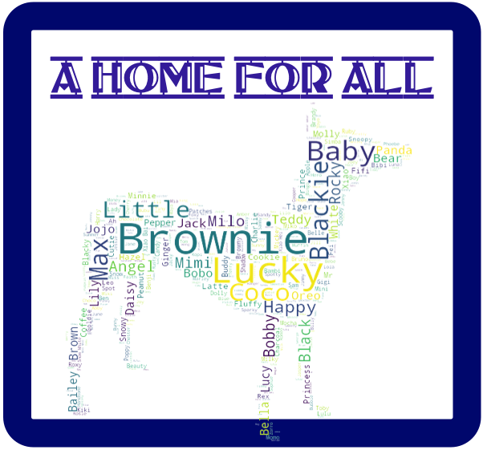
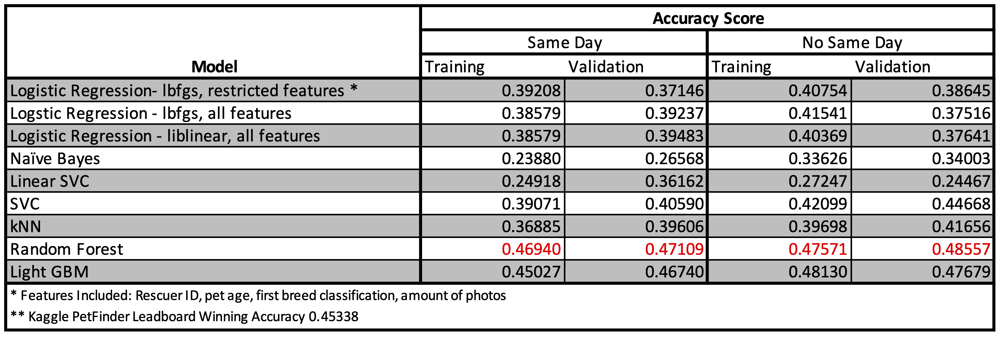
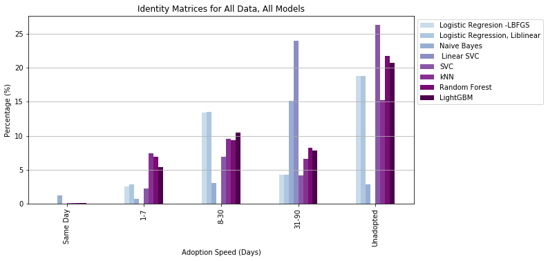

# **A Home for All<span>**

## <span><span style="color:mediumpurple">Overview<span>
A local animal shelter has requested that a methodology be developed to help them more strategically process animals and ultimately improve adoption outcomes for their current residents. By leveraging the Kaggle Petfinder data and analyzing the trends between dog’s features and adoption outcome, a set of models were developed. These models can be used by the client to develop a specific strategy for each type of dog and ensure the funds needed to support an animal finding a home are best leveraged. These models revealed that it’s easy to predict which animals are adopted in under 90 days. Those animals that take longer to adopt can be sent to intensive training, or resituated with a better positioned rescue to ensure their placement in the correct “Fur-ever” Home.

This project has been broken into four sections:
1. **[Data Wrangling:](https://github.com/CJEJansson/A-Home-for-All/blob/main/1.%20Data_Wrangling/Data_Wrangling.ipynb)** Downloading data, extracting features, creating features, data clean up
2. **[Data Storytelling:](https://github.com/CJEJansson/A-Home-for-All/blob/main/2.%20Data_Storytelling/Data_Storytelling.ipynb)** Analyzing graphically and statistically the impact of each feature on Adoption Speed.
3. **[Statistical Data Analysis:](https://github.com/CJEJansson/A-Home-for-All/blob/main/3.%20Statistical_Data_Analysis/Statistical_Data_Analysis.ipynb)** Analysing the statistical correlation between features of the dataset and Adoption Speed.
4. **[In Depth Analysis:](https://github.com/CJEJansson/A-Home-for-All/blob/main/4.%20In-Depth%20Analysis/In_Depth_Analysis.ipynb)** Application of machine learning techniques to predict adoption speed.

## <span><span style="color:mediumpurple">Table of Contents<span>
1. [Getting Started](#GettingStarted)
  * Requirements
  * Libraries
2. [The Data Set](#DataSet)
  * Files Used
3. ***RETURN HERE**
4. [Model Summary](#ModelSummary)
5. [Acknowledgements](#Acknowledgements)


## <span><span style="color:mediumpurple">Getting Started<span> <a name ="GettingStarted"></a>
### <span><span style="color:orchid">Requirements<span>

Viewing this project will require an installation of Juypyter Notebook or use of the [nbviewer](https://nbviewer.jupyter.org/) website. Running the code provided in this project will require Python v.3.7.1 and those libraries listed at the top of each notebook.

### <span><span style="color:orchid">Libraries<span>
* For Data Wrangling
  * Numpy
  * Pandas
* For Data Storytelling
  * Numpy
  * Pandas
  * Matplotlib
  * Seaborn
  * os
  * wordcloud
  * PIL
  * functools.reduce
* Statistcal Data Analysis
  * Numpy
  * Pandas
  * Matplotlib
  * Seaborn
  * Scipy.stats
  * pylab.savefig
* For In-Depth Analysis


## <span><span style="color:mediumpurple">The Data Set<span>


### <span><span style="color:orchid">Prerequisites<span>

What things you need to install the software and how to install them

```
Give examples
```

### <span><span style="color:mediumpurple">Installing<span>

A step by step series of examples that tell you how to get a development env running

Say what the step will be

```
Give the example
```

And repeat

```
until finished
```

End with an example of getting some data out of the system or using it for a little demo

## <span><span style="color:mediumpurple">Running the tests<span>

Explain how to run the automated tests for this system

### <span><span style="color:mediumpurple">Break down into end to end tests<span>

Explain what these tests test and why

```
Give an example
```

### <span><span style="color:mediumpurple">And coding style tests<span>

Explain what these tests test and why

```
Give an example
```

## <span><span style="color:mediumpurple">Deployment<span>

Add additional notes about how to deploy this on a live system

## <span><span style="color:mediumpurple">Built With<span>

* [Dropwizard](http://www.dropwizard.io/1.0.2/docs/) - The web framework used
* [Maven](https://maven.apache.org/) - Dependency Management
* [ROME](https://rometools.github.io/rome/) - Used to generate RSS Feeds

## <span><span style="color:mediumpurple">Contributing<span>

Please read [CONTRIBUTING.md](https://gist.github.com/PurpleBooth/b24679402957c63ec426) for details on our code of conduct, and the process for submitting pull requests to us.

<a name ="ModelSummary"></a>
## <span><span style="color:mediumpurple">Model Summary<span>

### <span><span style="color:orchid"> Model Accuracy Scores <span>
Typically, these model scores would leave room for improvement. It bears noting that the first place model on the leaderboard had an accuracy score of 0.45338. A summary of the model performance can be seen below:



### <span><span style="color:orchid"> Model Results<span>
A summary of each model’s accuracy was created by pulling only the True-Positive classifications out of the identity matrix and plotting them side by side. This summary was found to be most useful when eliminating data from the models for those pets that were adopted on the same day, due to the randomness of this event. However, a summary plot of accuracy for each prediction by model when studying all animals can be seen in Appendix A. The summary chart for only animals who were not adopted on the same day as being listed can be seen in the figure below.



<a name ="Acknowledgements"></a>
## <span><span style="color:mediumpurple">Author <span>

* **Caitlin Jansson** - *Initial work* - [A Home For All](https://github.com/CJEJansson/A-Home-for-All)

## <span><span style="color:mediumpurple"> Acknowledgments <span>

* https://towardsdatascience.com/the-search-for-categorical-correlation-a1cf7f1888c9
* https://www.aspca.org/animal-homelessness/shelter-intake-and-surrender/pet-statistics
* https://www.kaggle.com/c/petfinder-adoption-prediction/discussion/81597
* Special thanks to Kenneth Gil-Pasquel for support, guidance, and input on this project.
